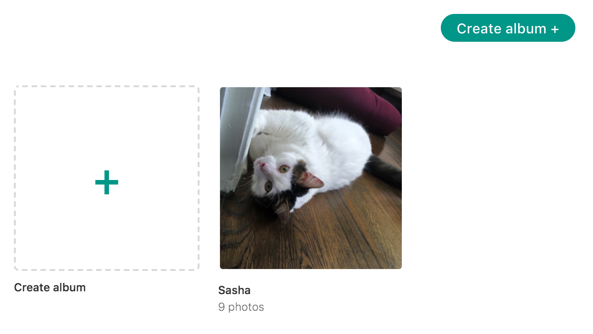

This is a decentralized, peer-to-peer photos applicaton for the [Beaker
browser](https://beakerbrowser.com).

*Create and share photo albums completely independently. No third party required.*

## Instructions

With [Beaker](https://beakerbrowser.com), open the app's URL:

On Hashbase: `dat://p2p-photos-taravancil.hashbase.io`

Raw URL: `dat://f0abcd6b1c4fc524e2d48da043b3d8399b96d9374d6606fca51182ee230b6b59/`

All photos are stored locally on your device, and are only ever visible to 
people with whom you share the album's secret URL.
